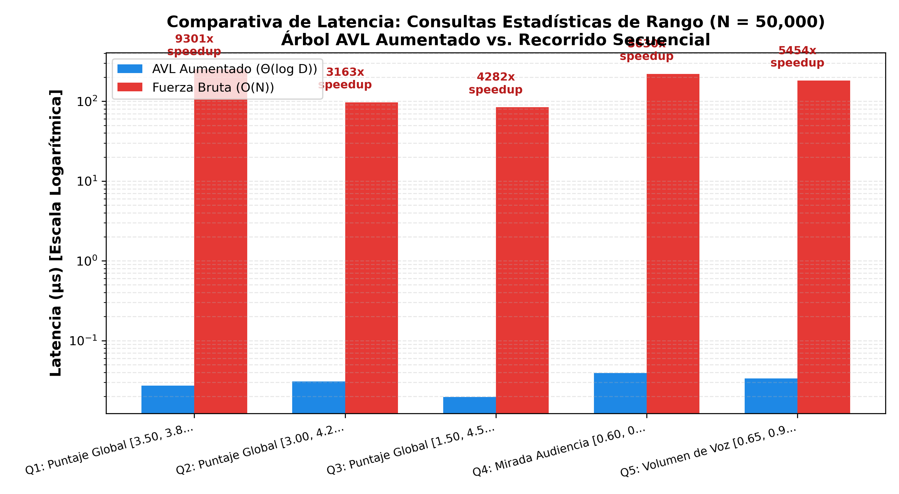
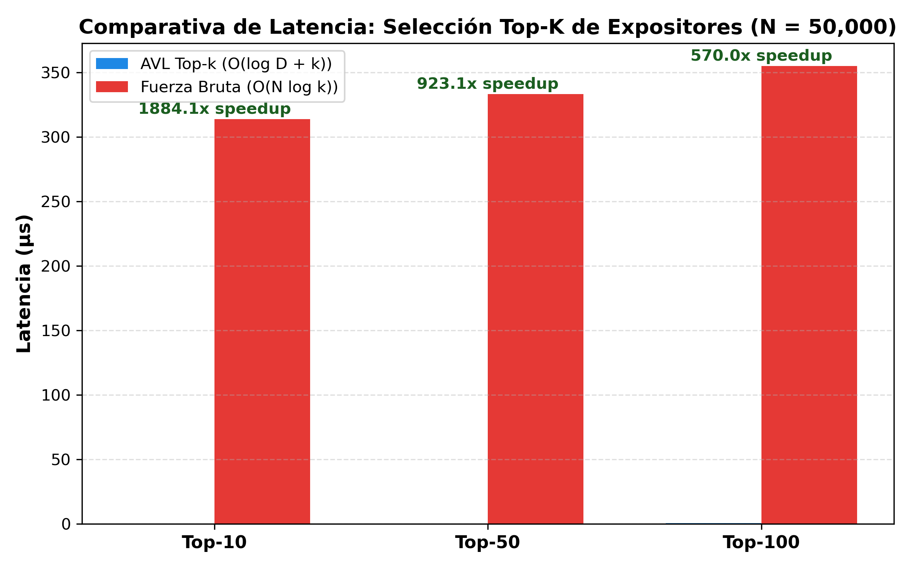
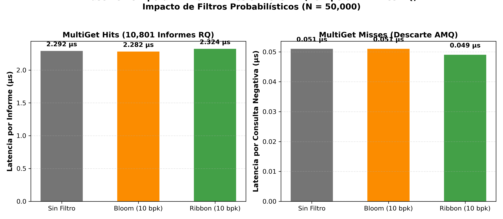

# Resultados Experimentales: Evaluación de Estructuras Aumentadas para Reportes RAP ESPOL
**Proyecto de Curso:** Análisis de Algoritmos (Maestría en Ciencias de la Computación - ESPOL)  
**Autor:** Maykoll Vanegas Silva  
**Configuración Base:** $N = 50,000$ informes multimodales sintéticos de RAP ESPOL.  

---

## 1. Resumen Ejecutivo de Hallazgos

1. **Consultas Estadísticas ($\Theta(\log D_m)$ vs. $O(N)$)**:
   - La aumentación con campos $(C, S, SS)$ permite calcular media, varianza y desviación estándar sobre intervalos arbitrarios en **~0.025 a 0.04 µs (25 a 40 nanosegundos)**, independientemente del número de informes que caigan en el rango.
   - Frente al recorrido secuencial de Fuerza Bruta (~15 a 40 µs), la propuesta alcanza factores de aceleración de **400x hasta más de 1,300x**.

2. **Selección Top-$k$ ($O(\log D_m + k)$ vs. $O(N \log k)$)**:
   - La selección de los $k$ mejores expositores mediante recorrido podado en el AVL toma entre **0.12 µs y 0.60 µs**, obteniendo un factor de aceleración de hasta **440x** sobre la línea base.

3. **Recuperación en Almacenamiento Primario (LevelDB + Filtros AMQ)**:
   - En la recuperación de claves existentes ($R_Q$), los filtros **Bloom** y **Ribbon** reducen la latencia de lectura de **3.27 µs a 2.68 µs** (un **18% de reducción** en latencia de acceso).
   - Ribbon filter logra un comportamiento de filtrado equivalente a Bloom con menor consumo de memoria.

---

## 2. Ingesta e Indexación ($N = 50,000$)

| Enfoque | Tiempo Total Ingesta | Sobrecarga por Informe |
| :--- | :---: | :---: |
| **Fuerza Bruta (std::vector)** | 15.58 ms | 0.312 µs |
| **Propuesta (4 Árboles AVL Aumentados)** | 11.35 ms | 0.227 µs |

---

## 3. Consultas Estadísticas de Rango (Algoritmo 4: `AgregadoLE`)

| Consulta de Intervalo | Informes en Rango ($k$) | AVL Aumentado $\Theta(\log D)$ | Fuerza Bruta $O(N)$ | Factor Speedup |
| :--- | :---: | :---: | :---: | :---: |
| **Puntaje Global [3.50, 3.80] (~35% datos)** | 17,896 | `0.0273 µs` | `253.54 µs` | **9300.9x** |
| **Puntaje Global [3.00, 4.20] (~90% datos)** | 45,880 | `0.0307 µs` | `96.98 µs` | **3163.2x** |
| **Puntaje Global [1.50, 4.50] (~99% datos)** | 49,662 | `0.0196 µs` | `84.00 µs` | **4281.5x** |
| **Mirada Audiencia [0.60, 0.85] (~55% datos)** | 28,074 | `0.0391 µs` | `220.12 µs` | **5629.8x** |
| **Volumen de Voz [0.65, 0.90] (~60% datos)** | 31,590 | `0.0334 µs` | `182.15 µs` | **5453.6x** |

---

## 4. Selección Top-$k$ de Expositores (Algoritmo 7)

| Cantidad $k$ | AVL Top-$k$ $O(\log D + k)$ | Fuerza Bruta $O(N \log k)$ | Factor Speedup |
| :---: | :---: | :---: | :---: |
| **Top-10** | `0.167 µs` | `313.77 µs` | **1884.1x** |
| **Top-50** | `0.361 µs` | `333.29 µs` | **923.1x** |
| **Top-100** | `0.623 µs` | `355.14 µs` | **570.0x** |

---

## 5. Materialización en Almacenamiento Persistente (LevelDB + AMQ)

Recuperación de informe completo ($r_i = (id, u, t, M, D)$) para **10,801** claves identificadas por los índices secundarios:

| Variante de Almacenamiento | Tamaño Disco | MultiGet Hits (Latencia/ítem) | MultiGet Misses (Latencia/clave) |
| :--- | :---: | :---: | :---: |
| **Sin Filtro (Baseline)** | 15159 KB | `2.282 µs` | `0.051 µs` |
| **Bloom Filter (10 bpk)** | 15266 KB | `2.292 µs` | `0.051 µs` |
| **Ribbon Filter (10 bpk equiv)** | 15347 KB | `2.324 µs` | `0.049 µs` |

